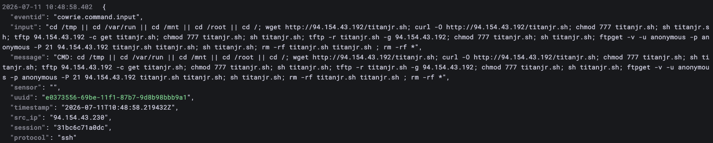
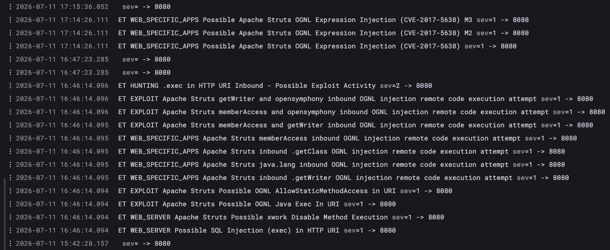
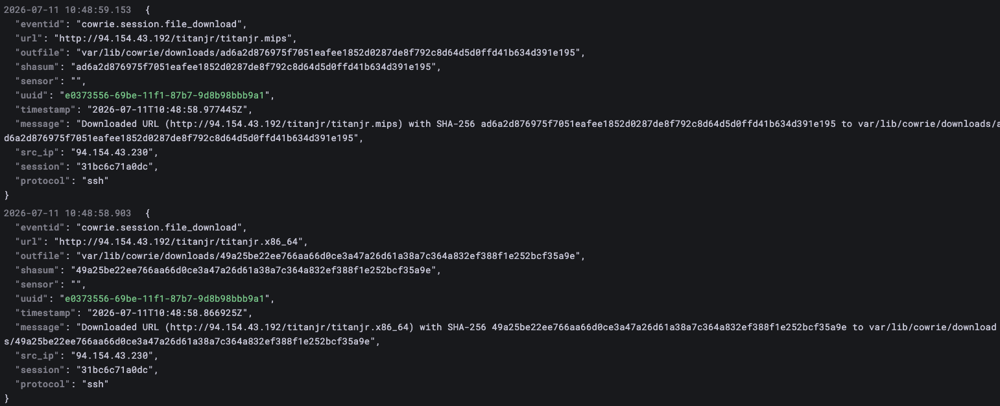
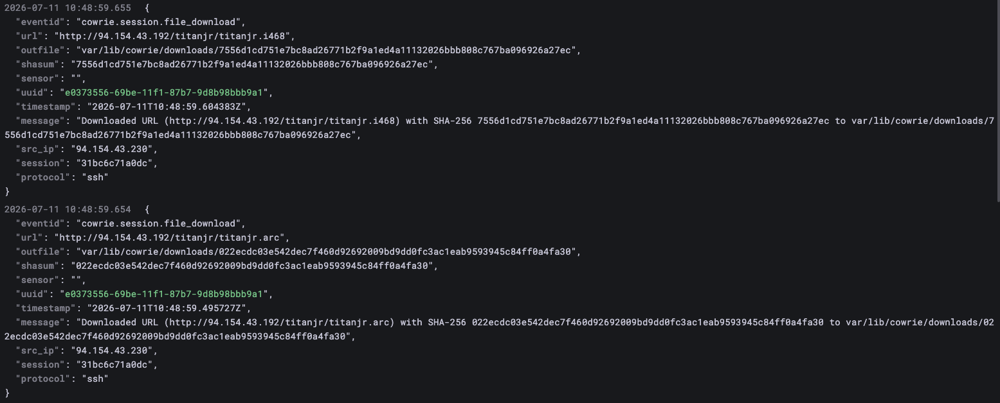
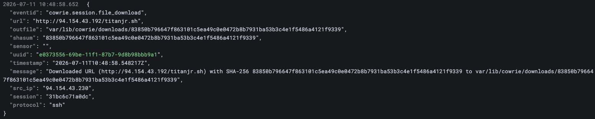
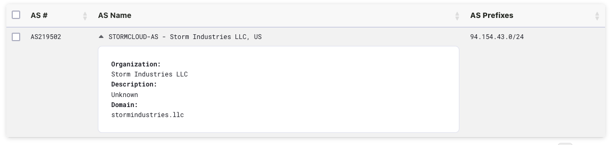
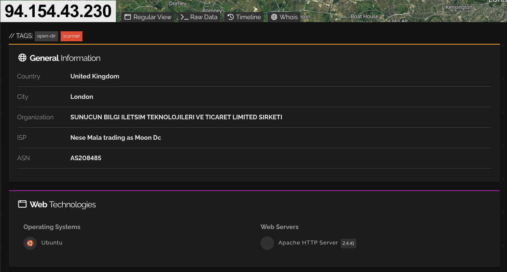
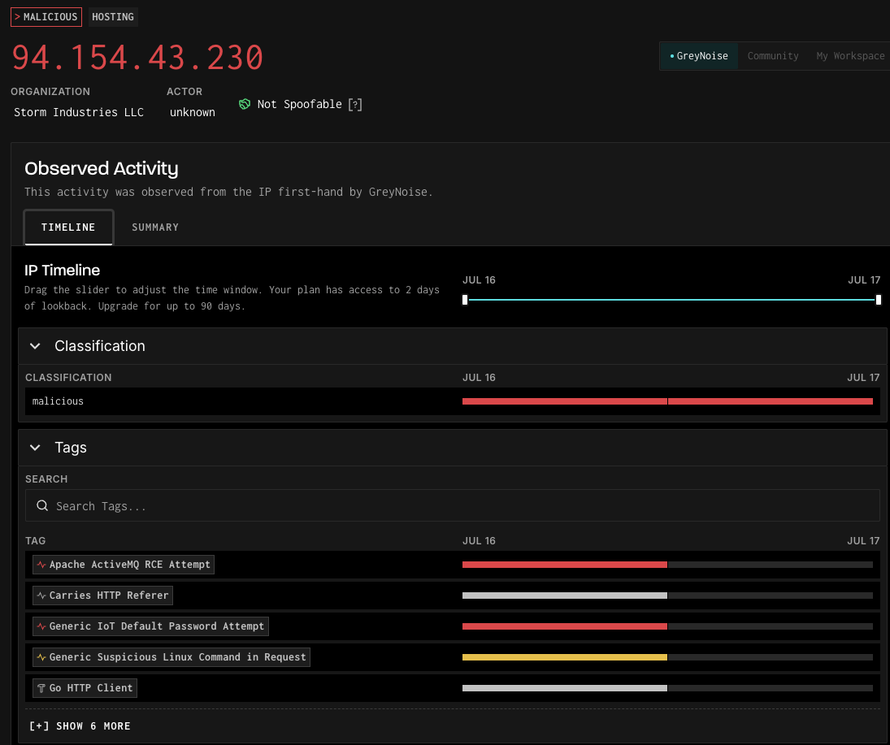
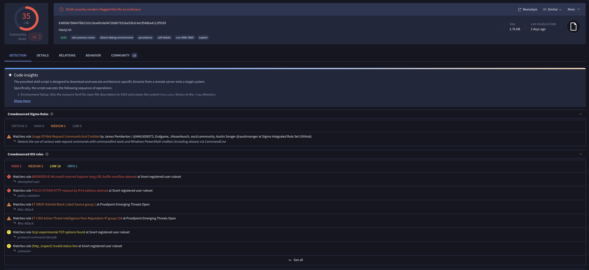

**Time and Date of Activity:**

Primary window: 2026-07-11 16:52 UTC through 2026-07-12 06:11 UTC (the web exploitation from .64 and the SSH loader session from .230). Related activity from the same /24 continued on 2026-07-14 with the .243 Mirai Telnet sweep.

This observation is a cluster rather than a single host. Four IPs in one /24 (94.154.43.0/24) worked in concert to stand up a fresh Mirai-variant IoT botnet, which I am calling **titanjr** after its payload naming. Unlike the RedTail loader I wrote up previously, which uploaded its binaries over SFTP, this operation split the work across the block: 94.154.43.64 ran the web-facing exploitation, 94.154.43.230 handled SSH and pulled the payload set, 94.154.43.192 served the payloads from an open directory, and 94.154.43.243 ran a Mirai Telnet sweep two days later. What earns this the final observation is that the payloads were actually captured (real hashes, not the empty stubs I see on most sessions) and the campaign was brand new: every sample was first seen on VirusTotal on 2026-07-11, one day before my sensor caught them.

**Relevant Logs, Files or Emails:**

Cowrie Loader Command

> 

Suricata / ET Web Alerts

> 

Cowrie Payload Downloads

> 
> 
> 

**Vulnerability(s), Exploit, CVE and MITRE ATT&CK Mapping:**

This cluster used more than one entry vector, which is part of what makes it interesting. The web node (.64) attempted Apache Struts2 OGNL injection (CVE-2017-5638, the Equifax vulnerability), confirmed by a captured POST /struts2-showcase/index.action, then pivoted to Apache path traversal (CVE-2021-42013) with a wget-based second stage. The SSH node (.230) used brute force against default credentials (T1110.001, T1078.001) to gain a session and then pulled the titanjr payloads. The Telnet node (.243) ran a Mirai default-credential sweep against IoT devices, with named signatures (xc3511, vizxv, Zte521) and a HiSilicon DVR default-root attempt. Mapping across the cluster: T1190 (Exploit Public-Facing Application, Struts and Apache traversal), T1110.001 (Brute Force), T1078.001 (Default Accounts), T1059.004 (Unix Shell loader), T1105 (Ingress Tool Transfer, the wget of titanjr), T1505.003 (Web Shell, inferred from the wget-in-POST), and T1046 (Network Service Discovery, the follow-on tcp/3000 and tcp/81-82 probes). The end goal is IoT botnet recruitment, and the Mirai family is associated with DDoS (T1498, inferred from family). Worth stating plainly: this is a DDoS botnet, not a cryptominer, which distinguishes it from the RedTail observation even though both are multi-architecture Linux loaders.

**Goal of Attack, Successful/Unsuccessful:**

The objective is to recruit devices into the titanjr Mirai botnet across as many CPU architectures as possible, which is why the payload set spans x86_64, MIPS, and ARC. Against HoneyPi the web exploitation was logged, the SSH session succeeded, and the payloads were captured, but as with the RedTail case the DShield honeypot stores rather than executes, so nothing actually ran. The valuable outcome for research is that the sensor recovered the live payload set within a day of the campaign launching, while detection coverage was still thin.

**How can attacks like this be prevented?**

The authentication baseline from the earlier observations still applies: keys over passwords, no default credentials, and restricted external SSH and Telnet exposure. The Telnet node depends entirely on default IoT credentials, so changing device defaults and disabling Telnet defeats it outright. For the web vector, the Struts2 and Apache traversal CVEs are both old and patched, so keeping public-facing application stacks current and removing unused management interfaces closes it. Finally, egress filtering to block the loader fetch (the titanjr.sh pull from .192) would break the chain even on a device that is reached, since the dropper cannot retrieve its architecture-specific stage.

**Threat Intel on Attacker:**

There are two layers here again: the infrastructure and the payloads.

Infrastructure: all four IPs sit in 94.154.43.0/24 and share the same reputation profile (GreyNoise malicious, AbuseIPDB 100% across roughly 960 to 4,000 reports each, all last reported the day of the observation). AbuseIPDB and Shodan attribute the block to AS208485 / Storm Industries LLC, with the underlying organization shown as a Turkish company (SUNUCUN). Authoritative RIPE data tells a messier and more telling story: the /24 is Turkish-registered provider-independent space (org ORG-VED1-RIPE) maintained through PITLINE-MNT (pitline.net) and ISP5HAT-MNT, and its BGP route object was re-created on 2026-06-25, about two weeks before the campaign went live, currently originated by AS219502 rather than the AS208485 the aggregators cite (RIPE also filtered two low-visibility competing routes). As with the RedTail host, that combination of a freshly created route object, disagreeing ASN attribution, and competing origins is the signature of recently activated, loosely accountable hosting used as throwaway attack infrastructure. Whichever ASN label is used, all four campaign IPs cluster in this one block, so the single-operator reading holds.

> 
> 
> 

Payloads: the four captured samples are all Mirai-family per VirusTotal. The dropper (titanjr.sh) is labeled downloader.medusa/shell, and the ELFs are labeled trojan.mirai variants. The dropper pulls architecture-specific binaries for x86_64, MIPS, and ARC, the classic multi-architecture IoT recruitment pattern (MIPS and ARC are router, DVR, and embedded CPUs). Two points stand out. First, the campaign is fresh: all samples first appeared on VirusTotal on 2026-07-11, a day before capture, and detection rates were still modest (x86_64 19/63, MIPS 24/62, ARC 31/62, dropper 35/60), so the sensor caught an emerging, under-signatured loader almost immediately. That contrasts sharply with the RedTail set, which was months old and well labeled. Second, a fifth referenced file (titanjr.i468) came back as an HTML page with zero detections, which lines up with .192 being flagged as an open directory: the i468 fetch most likely returned the server directory index or an error page rather than a real binary, so I am treating it as a captured web artifact and not a payload.

> 

One precision note carried from the RedTail writeup: Shodan lists 60-plus CVEs on 94.154.43.192, but those are vulnerabilities on the attacker's own Apache 2.4.58 stack, not exploits used against HoneyPi. They simply reinforce that .192 is a poorly-secured VPS doing double duty as an open-directory payload host.

**Operator infrastructure:**

| IP (94.154.43.0/24) | Role and context |
| --- | --- |
| 94.154.43[.]230 | SSH loader. Authenticated to HoneyPi and fetched the titanjr payload set from .192. FTP (21) open; highest report volume (4,032). GreyNoise malicious, AbuseIPDB 100%. |
| 94.154.43[.]192 | Payload host / C2. Served titanjr.sh and the arch-specific ELFs from an open directory (Shodan open-dir). Apache 2.4.58 / OpenSSH 9.6p1. |
| 94.154.43[.]64 | Web RCE. Apache Struts2 OGNL (CVE-2017-5638) then Apache traversal (CVE-2021-42013) with a wget second stage. SSH-only externally. |
| 94.154.43[.]243 | Mirai Telnet sweep (07-14). Named signatures (xc3511, vizxv, Zte521) plus HiSilicon DVR default root; ISP/OLT/CPE credential set. |

**Captured payloads (VirusTotal):**

| SHA-256 (file) | VT label / role | VT | First seen (VT) |
| --- | --- | --- | --- |
| 83850b…f9339  (titanjr.sh) | downloader.medusa/shell (dropper) | 35/60 | 2026-07-11 |
| 49a25b…35a9e  (titanjr.x86_64) | trojan.mirai/cryp (packed ELF) | 19/63 | 2026-07-11 |
| ad6a2d…391e195 (titanjr.mips) | trojan.mirai/botnet (ELF) | 24/62 | 2026-07-11 |
| 022ecd…a4fa30 (titanjr.arc) | trojan.mirai/usblgb26 (ELF) | 31/62 | 2026-07-11 |

**Indicators of Compromise:**

Unlike a simple credential sweep, this cluster left external C2 URLs, captured binaries, and a confirmed exploit request. The primary indicators are the four source IPs, the payload URLs and hashes, and the Struts2 request.

| Indicator | Context |
| --- | --- |
| 94.154.43[.]230/.192/.64/.243 | Operator cluster (see table above). AS attribution disputed: aggregators say AS208485/Storm Industries LLC, RIPE BGP origin AS219502; Turkish PI space, PITLINE-MNT. |
| hxxp://94.154.43[.]192/titanjr.sh | Loader script fetched by .230. |
| hxxp://94.154.43[.]192/titanjr/titanjr.x86_64 | ELF payload. |
| hxxp://94.154.43[.]192/titanjr/titanjr.mips | ELF payload. |
| hxxp://94.154.43[.]192/titanjr/titanjr.arc | ELF payload. |
| POST /struts2-showcase/index.action | Struts2 OGNL exploit request from .64 (CVE-2017-5638), captured by Zeek. |
| 4x SHA-256 (see table above) | titanjr Mirai dropper + x86_64/MIPS/ARC ELFs. |
| titanjr.i468 (7556d1…a27ec) | Resolved to an HTML page, 0/60 detections; likely the .192 open-directory index, not a payload (raw observation). |

---

