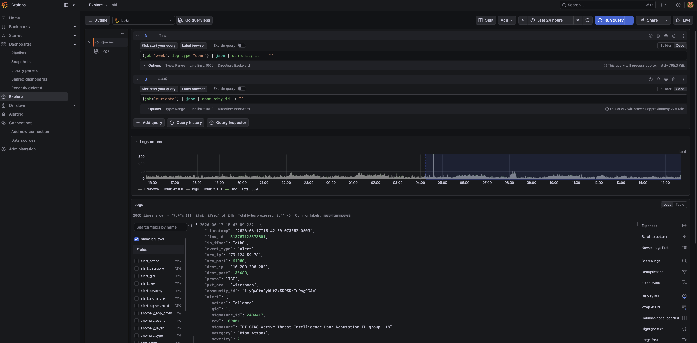
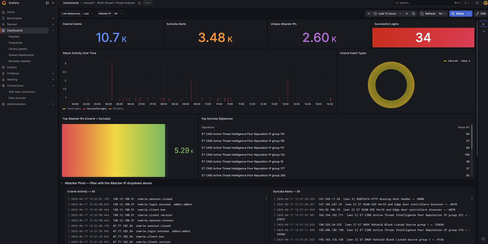

In the [previous post](/posts/enrich-honeypi/) I got two of the three streams live on the Pi: Cowrie and Suricata, both shipping to Loki through Alloy with a shared `src_ip` key. This post covers the Mac side, which is where the third stream comes in and where the whole correlation idea stops being a diagram and starts being something you can actually query. By the end of it, one attacker IP lights up across all three tools at once, and any single network flow can be matched between Suricata and Zeek deterministically rather than by eyeballing timestamps.

As before, full files are in the [honeypi repo](https://github.com/jsburnett/honeypi); the snippets here are the parts worth understanding.

## Why Zeek runs on the Mac and not the Pi

A reasonable question: I'm already capturing packets on the Pi with tcpdump, and Suricata is already on the Pi. Why not just run Zeek there too?

Two reasons. First, the Pi 4 is doing enough. It's running Cowrie, Suricata against 50k rules, tcpdump, and Alloy, all on a public-facing box getting hammered around the clock. Zeek's per-packet analysis is not cheap, and I'd rather not have it competing for cycles with the sensor's actual job of staying up and logging. Second, and more important for the design: Zeek processing the PCAPs *offline*, in batch, on the Mac means the analysis layer is fully decoupled from the capture layer. If Zeek crashes, misparses, or I want to reprocess a week of captures with a new script, none of that touches the live sensor. The Pi captures; the Mac analyzes. Clean separation.

The flow is: tcpdump on the Pi writes hourly gzipped PCAPs to `/mnt/dshield/pcap/`. The Mac pulls them over the existing admin SSH path, decompresses, runs each through Zeek, and a second Alloy instance ships the Zeek logs into the same Loki the Pi is feeding.

## Pulling the PCAPs

The direction of transfer matters here, and it's dictated by the FortiGate rules from [the network post](/posts/network/). The Pi cannot initiate connections to the internal network; that outbound deny is the actual security boundary of the whole deployment. So the Mac has to *pull*, reaching the Pi over the one admin path that's allowed: SSH on port 12222.

That's what the top of [`zeek_batch.sh`](https://github.com/jsburnett/honeypi/blob/main/mac/zeek_batch.sh) does:

```bash
rsync -az --ignore-existing \
  -e "ssh -p 12222 -i /Users/<youruser>/.ssh/<your-honeypi-key> -F /Users/<youruser>/.ssh/config" \
  --include='honeypot-*.pcap*' --exclude='*' \
  "<youruser>@<pi-internal-ip>:/mnt/pcap/" "$PCAP_DIR/"
```

`--ignore-existing` is doing real work: it means re-running the script only fetches *new* captures, never re-downloads what's already local. That's what makes it safe to run on a schedule. The explicit `-i` key and `-F` config flag matter because this runs unattended from cron later, where there's no interactive shell to fall back on default key discovery.

## Processing with Zeek

[Install Zeek](https://zeek.org/get-zeek/) via Homebrew:

```bash
brew install zeek
```

The processing loop walks the pulled PCAPs and runs each one through Zeek. The three flags passed to Zeek are the entire reason the downstream pipeline works, so they're worth understanding rather than copying:

```bash
zeek -C -r "$src" \
  local \
  policy/protocols/conn/community-id-logging \
  LogAscii::use_json=T \
  LogAscii::json_timestamps=JSON::TS_ISO8601
```

Going through these:

- `-C` disables checksum validation. Necessary because captured packets often have invalid checksums due to offload (the NIC computes them after capture); without this, Zeek ignores half the traffic.
- `-r "$src"` reads from a file rather than a live interface.
- `local` loads Zeek's default site policy, the standard set of analysis scripts.
- `policy/protocols/conn/community-id-logging` is the important one. It adds a **Community ID** hash to every connection record. More on why this is the linchpin below.
- `LogAscii::use_json=T` makes Zeek emit JSON instead of its default tab-separated format. Alloy parses JSON; without this flag you get TSV and the pipeline breaks.
- `LogAscii::json_timestamps=JSON::TS_ISO8601` formats the timestamps as ISO-8601, which the Alloy timestamp stage depends on to place events at *capture* time rather than ingest time.

After a run, spot-check that Zeek honored all three flags:

```bash
ls zeek-logs/
head -1 zeek-logs/*/conn.log | python3 -m json.tool
```

You're verifying three things in that JSON: it *is* JSON and not TSV, `ts` is ISO-8601, and a `community_id` field is present. All three are flags the script passes, so this is just confirming Homebrew's Zeek build honored them.

## Crossing the streams: Community ID

This is the part that makes the architecture more than three logs in one database.

A naive correlation across tools is "same source IP, around the same time." That's guesswork, and it falls apart the moment an attacker opens multiple simultaneous connections or two attackers share infrastructure. [Community ID](https://github.com/corelight/community-id-spec) solves this properly. It's a standard hashing scheme that takes the five-tuple of a flow (source IP, source port, destination IP, destination port, protocol) and produces an identical hash string in any tool that implements it.

Suricata implements it. Zeek implements it (that's the policy script above). So every network flow gets the *same* hash in both tools, something like `1:LQU9qZlK+B5F3KDmev6m5PMibrg=`. A Suricata alert now maps to its exact Zeek connection record deterministically. Not "probably the same flow," the same flow, provably.

Once both streams are flowing, you can watch this work directly in Grafana Explore's split view:

```logql
{job="zeek", log_type="conn"} | json | community_id != ""
{job="suricata"} | json | community_id != ""
```

Pick any flow on one side, search its hash on the other, and you get the same flow seen by two independent tools. For the holistic per-attack view the internship writeup wants, that's the difference between correlation and coincidence.


## The second Alloy instance

The Mac-side Alloy runs as a container in the same Docker Compose stack as Loki and Grafana, tailing the Zeek log directories. It's structurally similar to the Pi's Alloy but does one extra critical thing: it normalizes Zeek's source-IP field name so it matches the other two streams.

Here's the processing block from [`alloy-mac.alloy`](https://github.com/jsburnett/honeypi/blob/main/mac/alloy-mac.alloy):

```alloy
loki.process "zeek_json" {
  // Zeek JSON keys contain dots ("id.orig_h"), so quote them for JMESPath
  stage.json {
    expressions = {
      src_ip = "\"id.orig_h\"",
      ts     = "ts",
    }
  }

  // Normalize Zeek's originator IP to the same label key Cowrie/Suricata use
  stage.labels {
    values = {
      src_ip = "src_ip",
    }
  }

  // Use the packet timestamp, not ingestion time, since PCAPs are processed in batch
  stage.timestamp {
    source = "ts"
    format = "RFC3339"
  }

  forward_to = [loki.write.loki_server.receiver]
}
```

Three things here are the whole point of this file:

**The dotted-key quoting.** This is the trap I flagged in the last post finally biting for real. Zeek's source IP field is literally named `id.orig_h`. Alloy's `stage.json` uses JMESPath, where a dot means nested access. So an unquoted `id.orig_h` tells JMESPath "find object `id`, then field `orig_h`," which doesn't exist, and you get an empty value with no error. Quoting it as `"\"id.orig_h\""` tells JMESPath to treat the whole thing as one literal key name. This failed silently for me at first: the stream shipped, but `src_ip` was blank, and the dashboard pivot showed nothing for Zeek.

**The relabel to `src_ip`.** This is *the* normalization that the entire project hinges on. Zeek calls it `id.orig_h`; everything else calls it `src_ip`. This stage renames it on the way into Loki so all three jobs share one correlation key. Without this single stage, the Zeek stream would be an island, invisible to the `$src_ip` pivot and the report script's correlation. It is the most important four lines in the whole Mac config.

**The timestamp stage.** Because Zeek processes PCAPs in batch, possibly hours after capture, the default behavior would stamp every event with *ingest* time, bunching a whole day's attacks into the few seconds it took to process them. The timestamp stage reads the packet's own `ts` and places the event on the timeline where it actually happened. This is why, when you verify the Zeek stream, you have to set the Grafana time range to when the packets were *captured*, not now.

## Wiring it into Docker Compose

The Alloy service drops into the existing `cowrie-monitoring` compose stack next to Loki and Grafana (full file: [`mac/docker-compose.yml`](https://github.com/jsburnett/honeypi/blob/main/mac/docker-compose.yml)):

```yaml
  alloy:
    image: grafana/alloy:latest
    command: ["run", "/etc/alloy/config.alloy", "--storage.path=/var/lib/alloy/data"]
    volumes:
      - ./alloy-mac.alloy:/etc/alloy/config.alloy:ro
      - ../zeek-logs:/zeek-logs:ro
      - alloy-data:/var/lib/alloy/data
    depends_on:
      - loki

volumes:
  alloy-data:
```

Then:

```bash
docker compose up -d
docker compose logs alloy | tail -20
```

The healthy signature is a set of `start tailing file` lines for the conn/http/dns/ssl logs and no errors. One behavioral difference from the Pi-side Alloy worth knowing: these are *static* files, so this Alloy reads them from the beginning and ships the whole backlog, with timestamps taken from the packets rather than from now.

## Keeping it fed

Manual runs are fine for testing, but the third stream needs to feed itself. A cron entry at 15 minutes past the hour gives the Pi's hourly rotation time to finish writing and gzip before the Mac reaches for it (this and the other scheduled jobs are collected in [`docs/crontab-examples.md`](https://github.com/jsburnett/honeypi/blob/main/docs/crontab-examples.md)):

```cron
15 * * * * /Users/<youruser>/Projects/honeypi/zeek_batch.sh >> /Users/<youruser>/Projects/honeypi/zeek_batch.log 2>&1
```

## Technical hiccups

The Mac side had more sharp edges than the Pi side. The ones that cost me time:

**The dotted-key silent failure.** Covered above, but it deserves repeating as a hiccup because of *how* it fails. No error, no crash, the stream ships happily, and you only notice when a dashboard panel that should be full is empty. The lesson: when a normalized label comes back blank, suspect JMESPath key interpretation before anything else.

**`pushd`/`popd` and where Zeek writes.** Zeek writes its logs to the *current working directory*. The batch script uses `pushd "$outdir"` so each PCAP's logs land in their own directory, then `popd` to come back. I had a version where `popd` was inside a `|| true` guard and the directory stack got out of sync on an error path, so a later PCAP's logs wrote to the wrong place and Alloy never saw them. The fix was making sure `pushd` and `popd` sit at the same level and `popd` always runs. If Zeek clearly processed a capture but Alloy never tails the output, check where the logs actually landed first.

**Alloy only discovered directories that existed at startup.** After a Docker volume wipe, Alloy came up and tailed the Zeek directories that existed *at that moment*, but new hourly directories created afterward weren't picked up. The fix was the `sync_period` on the file match, which tells Alloy to re-scan for new matching paths on an interval rather than only at boot:

```alloy
local.file_match "zeek_logs" {
  path_targets = [ /* ... */ ]
  sync_period  = "10m"
}
```

Without that, every new hour's logs would sit on disk unread until the next container restart.

**The active-capture race.** The batch script must not process the PCAP that tcpdump is still writing to. The loop skips any uncompressed capture modified in the last 65 minutes, on the assumption that the current hour's file is still live and only the rotated-and-gzipped ones are safe to read. It's a heuristic, but it's held up.

## Where this leaves us

All three streams are now live and unified:

- **Cowrie**, **Suricata** (from the Pi), and **Zeek** (from the Mac) all in one Loki.
- One shared `src_ip` label across every job, so the dashboard's attacker pivot spans all three.
- Community ID in both Suricata and Zeek, so any flow joins deterministically between them.
- The Zeek leg feeding itself hourly via cron, decoupled from the live sensor.

Open the dashboard, set the time range to cover recent captures, and pivot the Attacker IP dropdown to one of the day's scanners. Every panel populating, Cowrie session detail next to Suricata signatures next to Zeek's port-by-port connection record, is the moment the whole thing comes together.



What's left is making sense of it all without manually reading thousands of events a day. That's the AI reporting layer, and it's the [final post](/posts/enrich-ai-reporting/).

