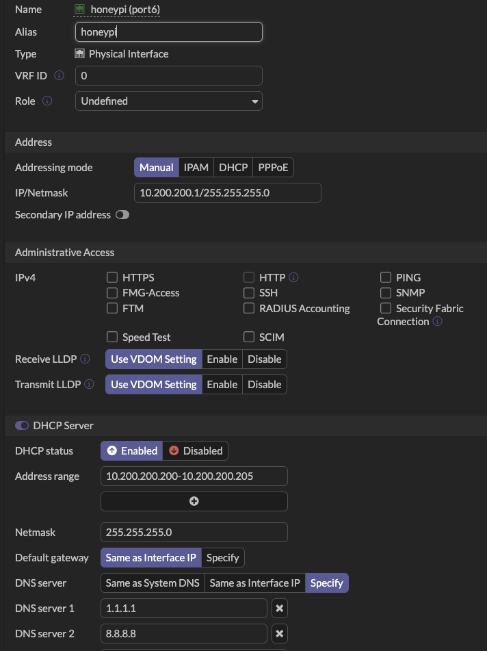
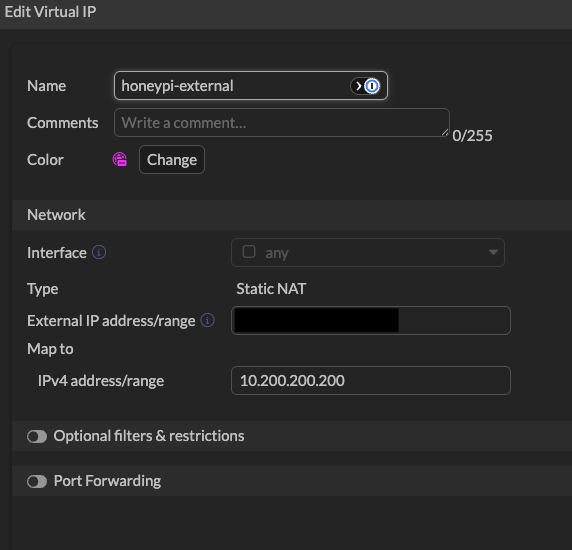
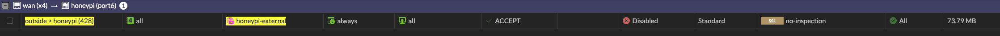
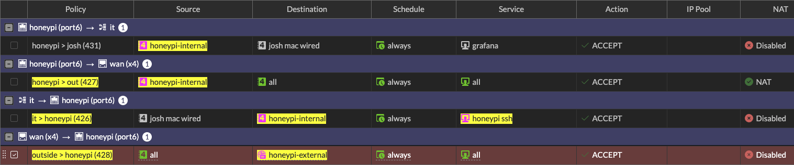
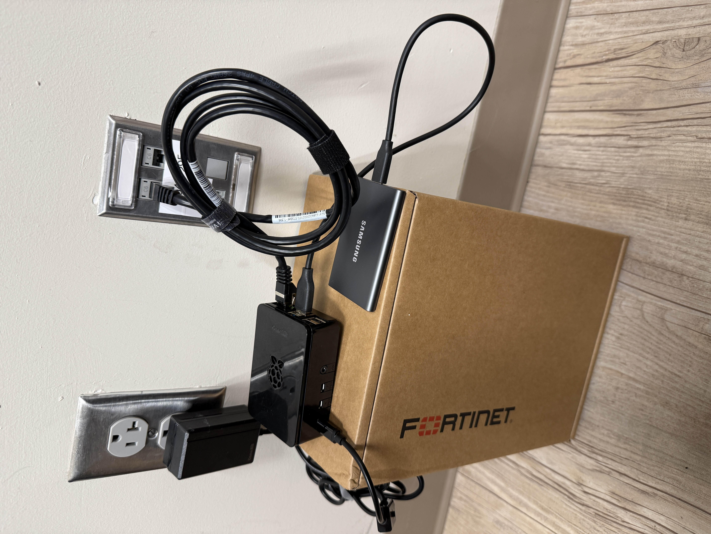
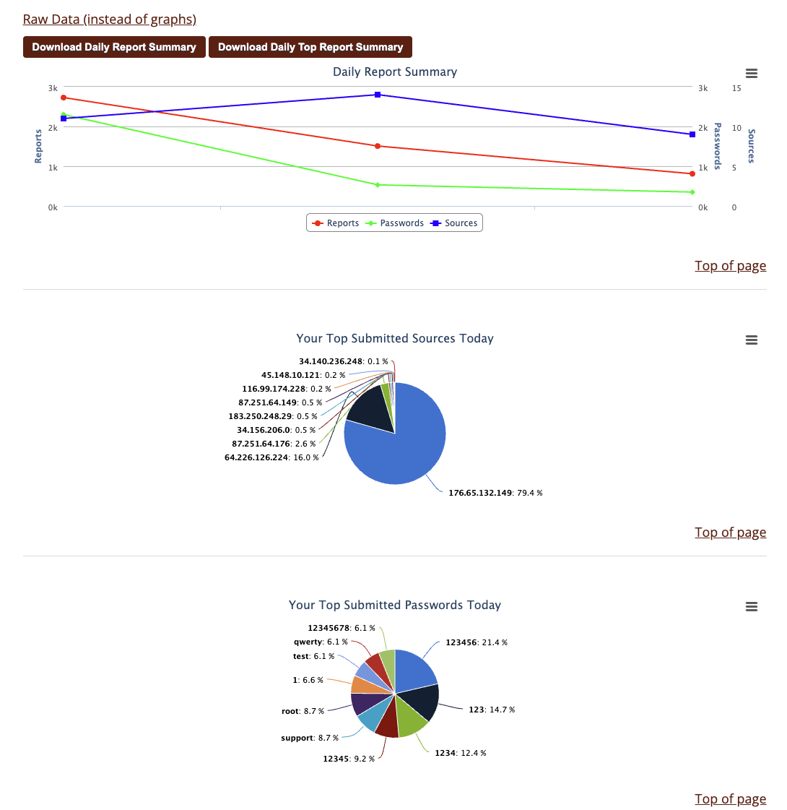
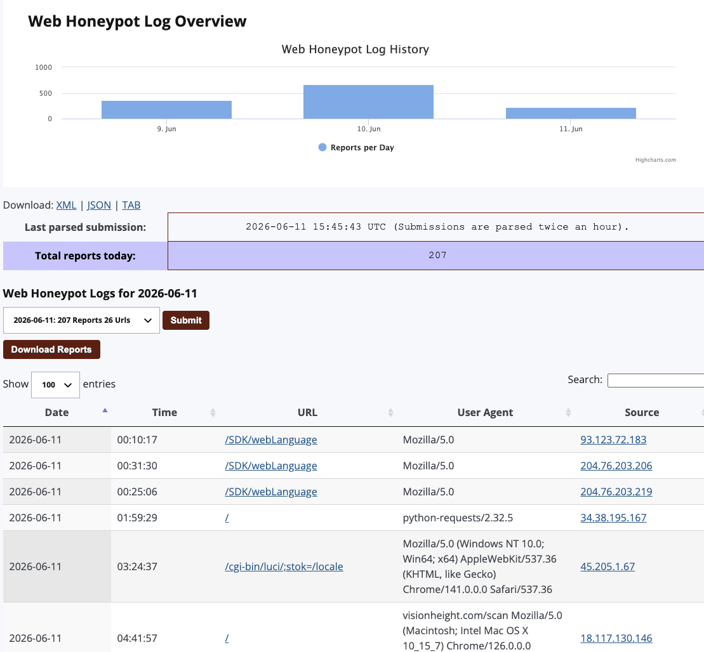
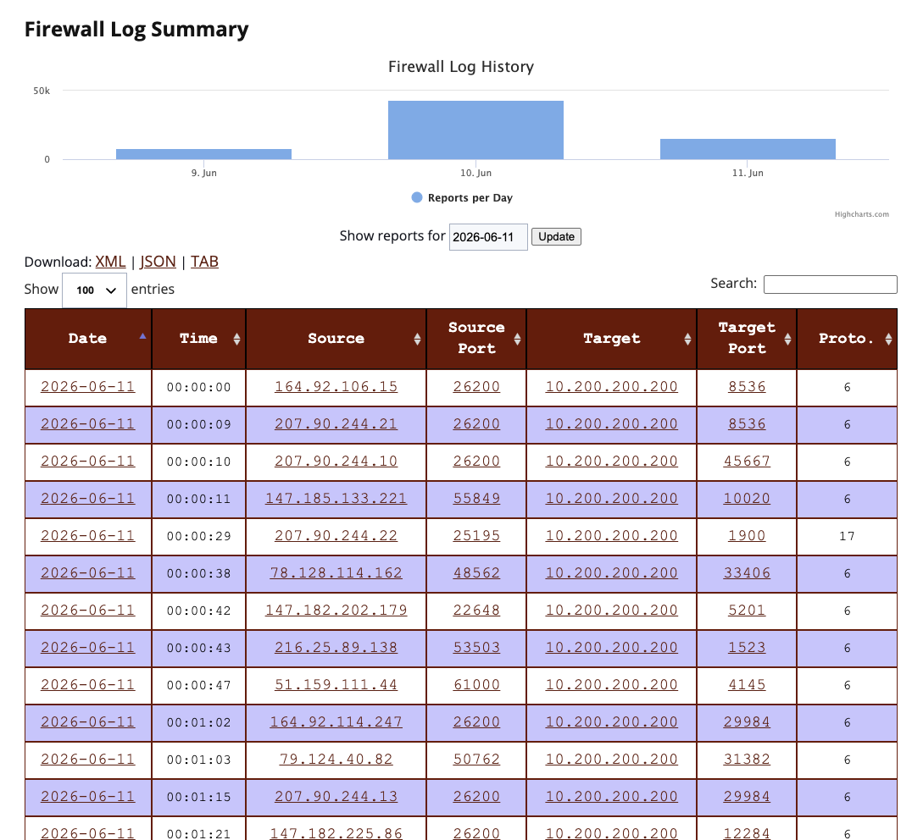

---
title: "HoneyPi Part 2: Network Setup"
date: 2026-06-12T09:00:00-05:00
tags: [dshield, honeypot, fortigate, fortios, isc-internship]
draft: false
---

Next came the network. For the deployment of the device I chose the office. I am at work more than I am at home and it also offers a lot more in terms of security and configurability. This will likely remain after the internship so that I can continue to play with it. Also, it can't hurt to have something sitting in our block that looks like a juicy target. It's a long shot but if someone scans our block and sees this maybe they will waste time here instead of on my actual assets. 

We utilize a FortiGate for our head end firewall. I setup a port specifically for this network and opted to stay away from a VLAN. This made sure I could more easily isolate the network, as well as not have to deal with removing the network from all my security measures that would surely pick up on the traffic hitting this thing.

I setup the network on the physical port, added DHCP just for ease of connectivity and used external DNS of course.

Just because of our particular network's inner workings (which I won't get into) I had to create a policy route for the traffic to get out.

The one-to-one NAT in FortiOS occurs in the "Virtual IPs" section of the system. We need this to be able to setup the policy that will allow all internet traffic to hit HoneyPi. 

Next come the actual policies, one for HoneyPi to get to the internet and one for the Internet to reach HoneyPi unobstructed. You will notice, there are no security profiles setup on either of these rules. Basically, I am saying HoneyPi meet the Internet, Internet meet HoneyPi, now you two play nice. Which I have to say is the first time I have done that, and it feels so wrong! Also note that NAT is turned off on the inbound policy, this is to preserve the real attacker source IPs. 

The last piece of the puzzle here was SSH access. I wanted to make sure that I had it locked down as tight as possible. I created a policy (and associated policy route) to allow my Mac here at the office to reach the internal address of HoneyPi over the 12222 port. The policy is one way, so I don't have to worry about anything coming back over it to my workstation. There is a baseline default deny all (not shown) in the policy list, which blocks all traffic unless a rule specifically allows it. That default deny allows me to lock down the traffic as tight as possible to ensure that only the traffic I want is allowed. Aside from the internet the only other thing communicating with HoneyPi is my Mac on ports 12222 and 3100 (more on that later). 

During this, the Raspberry Pi Connect I alluded to previously really shined. It allowed me to connect up even though I had already removed the monitor, mouse and keyboard and placed HoneyPi in its new home. Shoutout to the Fortinet firewall box that was a perfect size to act as a table.

That's all it took really. Once I had this setup I could sit and watch the traffic start rolling into the ISC dashboard. 

Which is great, but I started thinking that only using this site to try and research attacks, correlate feeds and then create meaningful assessments wouldn't be fun. 
Thus enter enrichment through Alloy, Loki, Grafana, Suricata, Zeek and most importantly AI (Dun dun duuuun!). 
