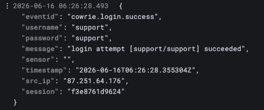
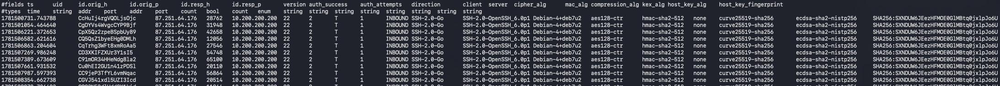
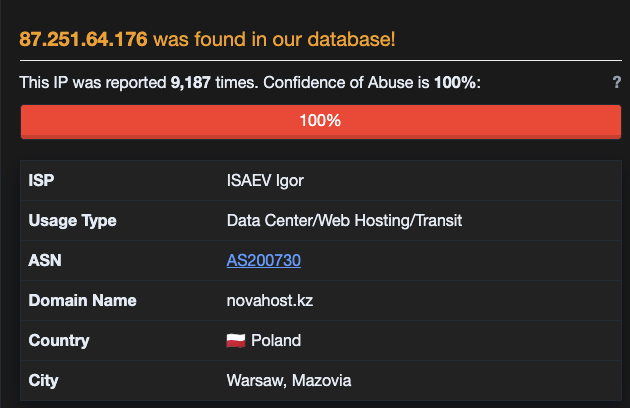
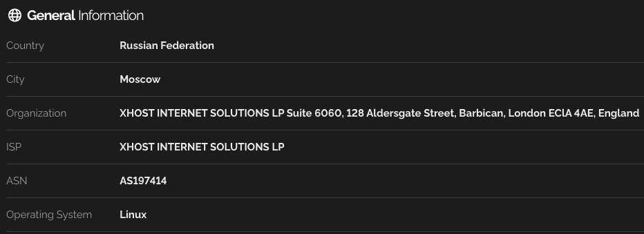
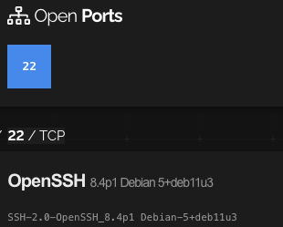
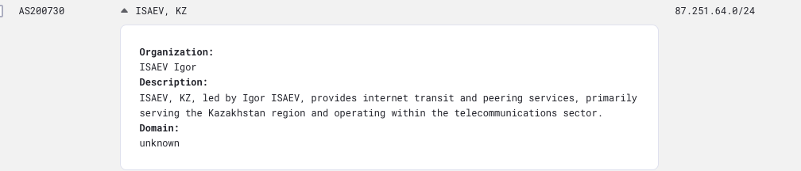
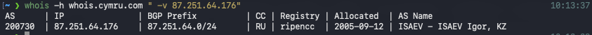

The full setup and configuration process behind HoneyPi was documented in the earlier parts of this series, so this post skips the build and goes straight to the first attack observation report I put together for my SANS Internet Storm Center internship. It focuses on a single attacker and walks it end to end.

## Initial Attack Observation

**Time and Date of Activity:**

2026-06-15 00:00:07 UTC through 2026-06-17 02:11:21 UTC

The attacker (source 87.251.64.176) was active for around 45 hours, with 114 successful logins occurring in bursts, indicating automated tooling running through a set of target IPs/hosts. Successful logins would occur in a burst, quiet down for a couple of hours then another burst. It should be noted that similar SSH-2.0-Go campaigns have been observed from other attackers since deployment of the HoneyPi, however this particular attacker was interesting because its attack pattern was persistent and observed from a single source, rather than cycling through different IPs like in other campaigns.

**Relevant Logs, Files or Emails:**

Cowrie SSH Session Logs

> 

Zeek Logging

> 

**Vulnerability(s), Exploit, CVE and MITRE ATT&CK Mapping:**

The vulnerability is simply a weak-auth posture and exposed management access, rather than a software exploit, so no CVE directly applies. The attack used the remote service SSH ([T1021.004](https://attack.mitre.org/techniques/T1021/004/)) as the channel to launch a brute force / password guessing campaign ([T1110.001](https://attack.mitre.org/techniques/T1110/001/)) against HoneyPi. The attacker latched onto a known and documented default credential ([T1078.001](https://attack.mitre.org/techniques/T1078/001/)), rather than running a broad dictionary attack or password spray.

**Goal of Attack, Successful/Unsuccessful:**

There were many (114 observed) successful logins utilizing the default password (support/support). This is where this particular attack differs from others I have observed. Cowrie recorded zero "cowrie.command.input" events for this source IP. There was no shell interaction; once the login was successful the session simply terminates. Each observed session is roughly a second in length. This activity suggests that this particular campaign is a credential validation sweep to stage targets for a future exploitation campaign.

**How can attacks like this be prevented?**

A combination of defenses can be implemented to thwart attacks like this. Changing default passwords, enforcing MFA or since this is SSH, configure the use of certificate-based authentication rather than password. The device could further be hardened by obfuscating the port, limiting external SSH access to known and permitted IPs, and finally simply removing external facing SSH access altogether if it isn't needed.

**Threat Intel on Attacker:**

Since this attack only included authentication attempts and left no files, commands or hashes to research we are limited to an IP based reputation lookup and host data. The IP 87.251.64.176 is at a maximum (100%) abuse confidence score on AbuseIPDB, with 9,184 community reports. This indicates it is a well-established and currently active attack source.

> 

Shodan shows only ssh (port 22) exposed and identifies the host as a Debian based system running OpenSSH 8.4p1. This is typical of dedicated ssh brute-force nodes like this. Shodan also reveals the ASN as AS197414 which actually conflicts with the ASN from AbuseIPDB shown above (AS200730). Further investigation found that the Shodan ASN seems to be either old or corrupted data. The AS200730 does in fact seem to be the truer listing.

> 
> 
> 
> 

It should be noted that GreyNoise came back with no hit on this IP. This suggests the source is not part of a broad mass-scanning network and is instead focused specifically on the SSH sweep, which aligns with the single-source behavior observed on HoneyPi.

**Indicators of Compromise:**

The main indicators for this attacker would be the source IP (87.251.64.176), the default credentials used (support:support), and the SSH client banner (SSH-2.0-Go). This sort of automated credential-validation sweep doesn't really leave any post compromise artifacts to analyze. The attacker simply confirms login and disconnects.

---

*AI (Claude specifically) was used as an analytical tool to tie observations together and assist in parsing large log files. The observations, direction, and written words are my own.*
