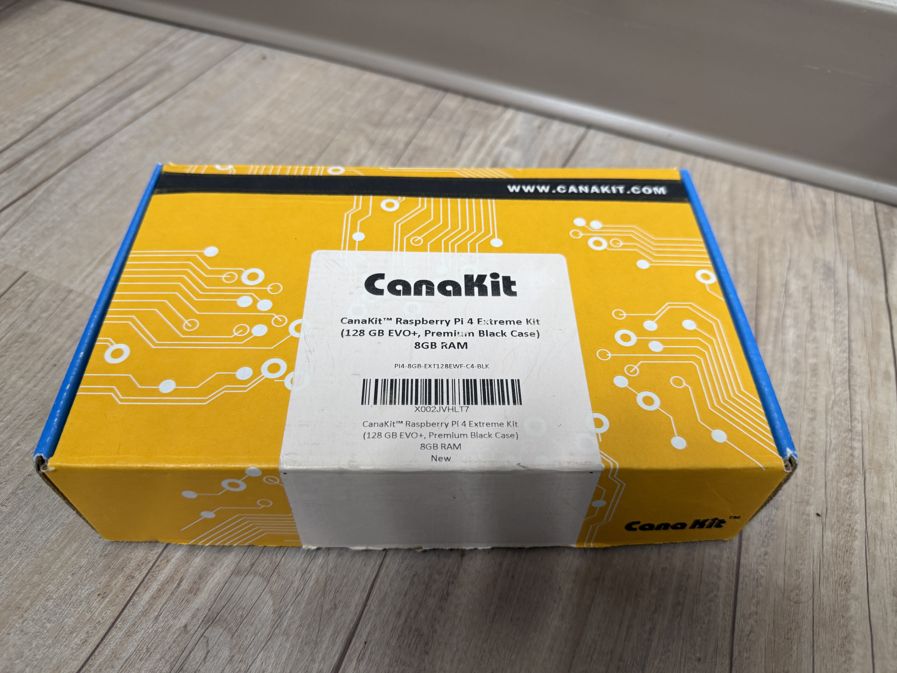

---
title: "HoneyPi Part 1: Setup and Backups"
date:  2026-06-12T08:00:00-05:00
tags: [dshield, honeypot, raspberry-pi, isc-internship]
draft: false
---

Finally found a cool use for the old Pi 4 I bought years ago. I bought it just because I have a need to collect all things technical in nature. The SANS ISC internship is giving me the perfect opportunity to put it to use!



Since it had been years I decided on a fresh install of the OS. I downloaded the latest [Raspberry Pi Imager](https://www.raspberrypi.com/software/) and followed the simple steps to creating a bootable microSD for my soon to be Honey Pi (yes a perfect name... you can hold your applause). I highly recommend during this process to setup the Raspberry Pi Connect as it helped me get to the thing remotely when I made a mistake on the networking side later on in the setup. Also, the imager will give you an option to go ahead and load your SSH Keys, I would do this as well since it makes connecting via SSH that much easier later on. 

Once I had the new MicroSD installed and the distro up, of course I ran a quick sudo apt update and sudo apt upgrade to get the latest updates. 
Then it was off to the races. I watched the [setup instructions](https://www.youtube.com/watch?v=fMqhoNnyvmE) that, while a little dated, has some good information regarding setup. So I won't bother regurgitating that information here. The instructions can also be found at the [DShield-ISC](https://github.com/DShield-ISC/dshield) GitHub page. 

One thing I did have an issue with when running through the dshield setup was when it came to entering the API Key. I am probably the only person this has ever stumped, but after entering my email I tried to use "tab" and/or the mouse to select the API Key line to paste in the key. Well, it's actually the down arrow on the keyboard... I know, I know after over 20 years in IT I should have thought of that first but it took me a shamefully long few minutes to figure that out. 

Knowing how flaky SD cards can be and the one I am using is rather old, I decided to setup a backup. Not an automated one but just an external I could push a backup to so I didn't have to start from scratch. I had a couple of Samsung SSD externals laying around the office so I decided to format one and use it. After making any substantial changes to the system, or getting a workflow actually working I would run a backup. You could do versioned backups, but I just used the same file name and overwrote it whenever it made sense. 

### Backup Steps
*Identify Drive and unmount (if needed) to format*
```bash
lsblk
sudo umount /dev/sda1 
```

Format and Label (I called mine the super creative "data")
```bash
sudo mkfs.ext4 -L data /dev/sda1
```

Create mount point and Mount
```bash
sudo mkdir -p /mnt/dshield 
sudo mount /dev/sda1 /mnt/dshield
```

Grab the UUID and add to fstab for persistence
```bash
sudo blkid /dev/sda1  
sudo nano /etc/fstab
```
```bash
UUID=<insertuuidhere> /mnt/dshield ext4 defaults,noatime 0 2
```

Then just Image the SD to the SSD
```bash
sudo dd if=/dev/mmcblk0 of=/mnt/dshield/pi-backup.img bs=4M status=progress
```

For restoring (if needed)
```bash
sudo dd if=/mnt/dshield/pi-backup.img of=/dev/sdX bs=4M status=progress
```

When restoring (or backing up for that matter) ensure the target disk identifier is correct. Always double check so you aren't backing up what you don't mean to or restoring where you don't mean to. The commands above are guideline examples and may differ on your machine.

This takes care of the basic setup of the actual device and backups. Now how do we talk to it... 


